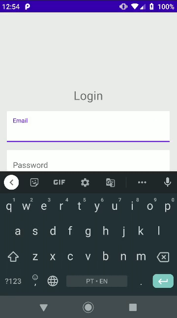
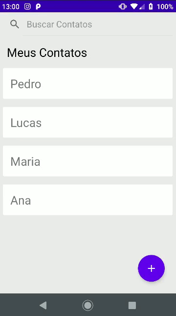
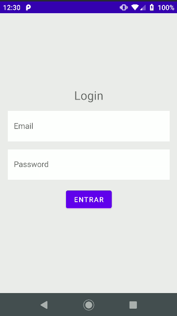
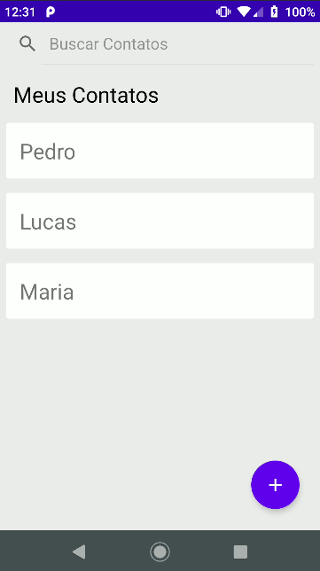
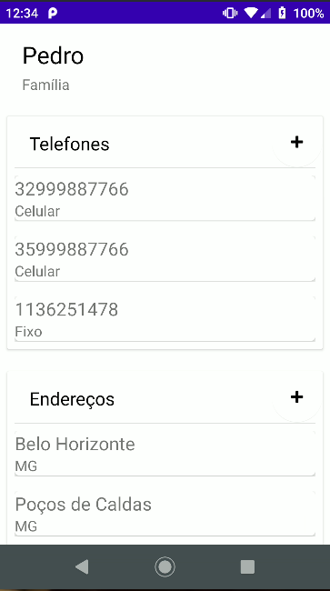
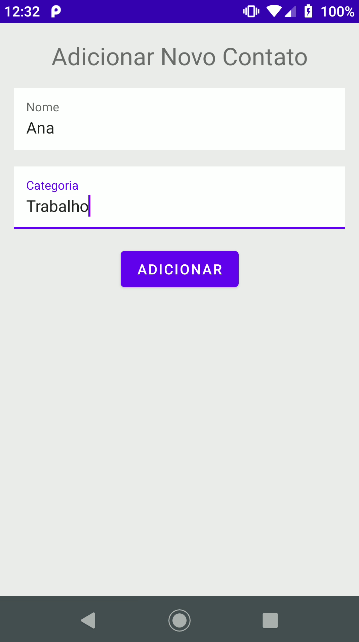
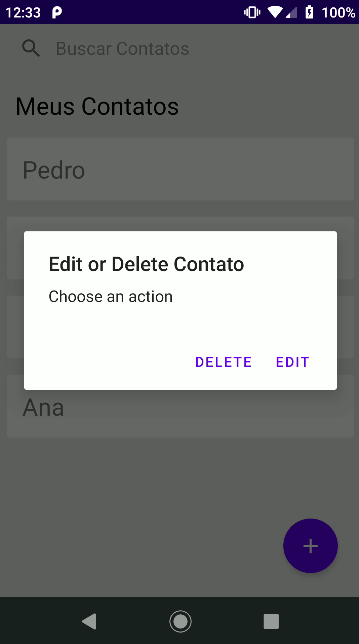
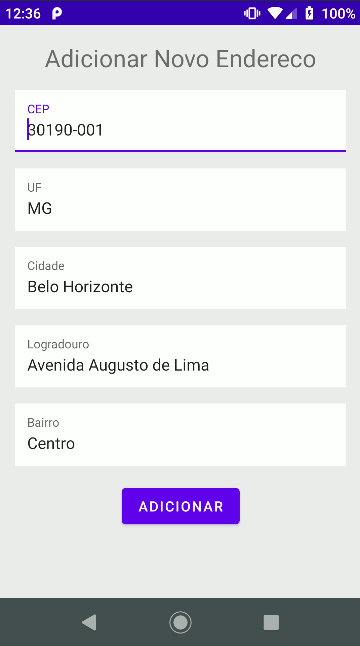
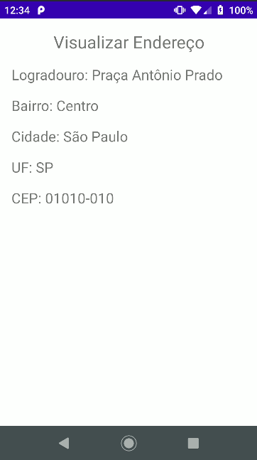
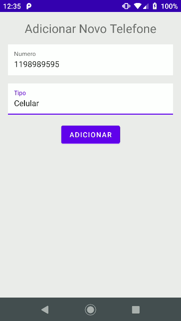

## Front-end

App mobile android nativo implementado em java.

Agenda de Contatos:

* Cadastro de contatos;
* Busca de endereço pelo CEP / API ViaCEP;
* Categorização / Agrupamento dos contatos;
* Busca de contatos com sugestão de pesquisa;
* Possibilidade de muitos endereços e telefones por contato;
* Autenticação (somente usar após login no app);
* Responsividade (funcionar em diferentes tamanhos de dispositivos);
* Formulários de cadastro com validação (em front e backend);

### APP Overview












## Back-end

Api implementada em PHP/Laravel usando JSON e o padrão REST, com banco de dados em MySQl.

A api possuí autenticação baseada em tokens de acesso. O aplicativo recebe um token de acesso depois que um usuário autentica e autoriza o acesso com êxito e, em seguida, passa o token de acesso como uma credencial ao chamar a API de destino. O token transmitido informa à API que o portador do token foi autorizado a acessar a API e executar ações específicas especificadas pelo escopo que foi concedido durante a autorização.

Laravel Sanctum fornece um sistema de autenticação leve para SPAs (aplicativos de página única), aplicativos móveis e APIs simples baseadas em tokens. O Sanctum permite que cada usuário de seu aplicativo gere vários tokens de API para sua conta. Esses tokens podem receber habilidades / escopos que especificam quais ações os tokens podem realizar.

### Como Instalar

* Clone o repositório:

```
git clone https://github.com/IzaRam/agenda-app.git
```

* Na pasta raiz do projeto da API, execute o seguinte comando para instalar as dependências necessárias:

```
composer install
```

* Crie o arquivo de configuração de variáveis de ambiente:

```
cp .env.example .env
```

Configure as variáveis de ambiente e a conexão com o bando de dados no arquivo .env:

```
DB_CONNECTION=mysql
DB_HOST="HOST_NAME"
DB_PORT="PORT, DEFAULT=3306"
DB_DATABASE="DATABASE_NAME"
DB_USERNAME="YOUR_MYSQL_USERNAME"
DB_PASSWORD="YOUR_MEYSQL_PASSWORD"
```

* Execute o seguinte comando para gerar as tabelas no banco de dados:

```
php artisan migrate
```

* Execute para gerar uma nova key para a aplicação:

```
php artisan key:generate
```

* Execute o seguinte comando para iniciar o servidor:

```
php artisan serve --host "your_local_address" --port "port_number"
```

### Endpoints da API

Rotas Públicas:

* Auth Routes
```
POST /api/register
POST /api/login
```

Rotas Protegidas:

* Auth Routes
```
POST api/logout
```

* Contatos
```
GET /api/contatos/{user_id}
GET /api/show/contatos/{contato_id}
POST /api/contatos/{user_id}
PUT /api/update/contatos/{contato_id}
DELETE /api/delete/contatos/{contato_id}
```

* Telefones
```
POST /api/telefone
PUT /api/telefone/{telefone_id}
DELETE /api/telefone/{telefone_id}
```

* Endereços
```
POST /api/endereco
PUT /api/endereco/{endereco_id}
DELETE /api/endereco/{endereco_id}

```
